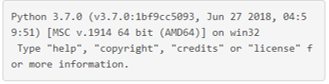
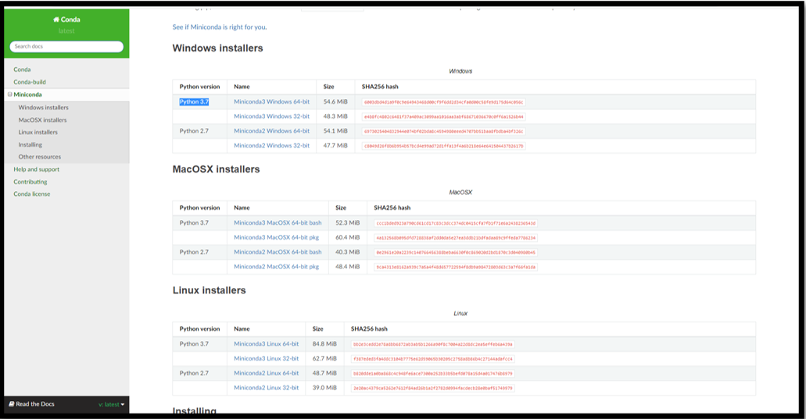
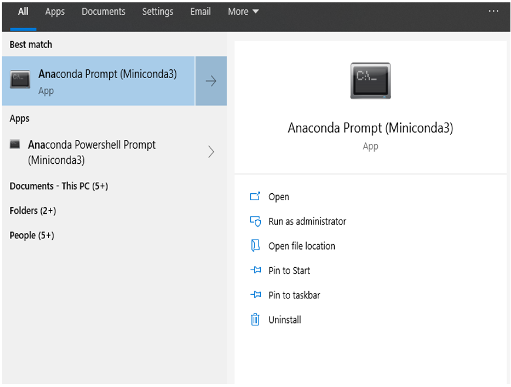
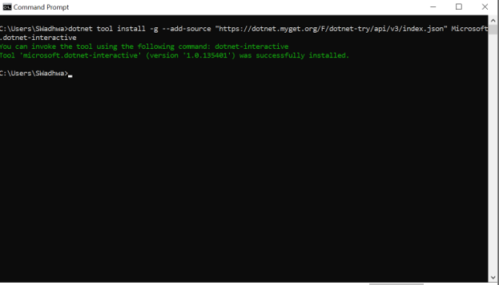
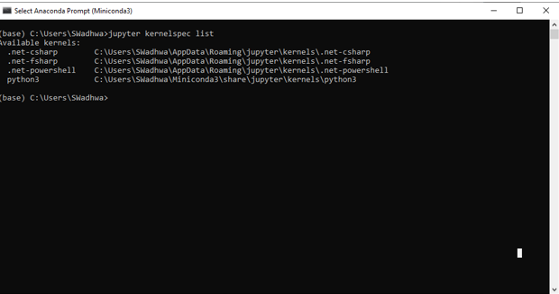
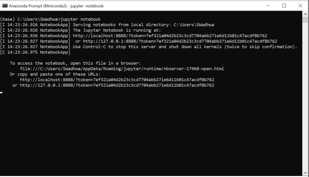
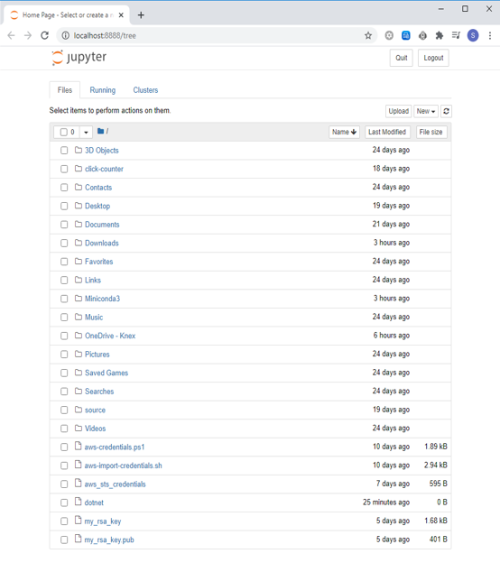

# Optimization 101 Workshop in F#

## Jump to Section

[Setting Up .NET Interactive with Jupyter using pip](#1.-installing-pip-and-downloading-jupyter-notebooks)

[Setting Up .NET Interactive with Jupyter using Miniconda](#2.-downloading-miniconda-(alternative-to-pip))

[Setting Up .NET Notebooks in Visual Studio Code Insiders](#setting-up-.net-interactive-notebooks)

## Background

This [repo][OptimizationRepo] contains the content for the Optimization 101 Workshop developed by the QTrade group. To work the Practice problems it is recommended to have Jupyter Notebooks installed and the `Flips` library. The solutions were built and tested with .NET Interactive Notebooks in Visual Studio Code Insiders. Versions of software used:

- conda 4.8.2
- F# 5.0
- Flips


The workshop is meant to stagger slides with code examples. The `Practice` folder holds the initial state of the problems in the order of the exercises. The `Solutions` folder has the answers to the Practice problems. There is more than one way to formulate the solution so your code does not necessarily need to match.

## Initial Setup
### SETTING UP .NET INTERACTIVE WITH JUPYTER NOTEBOOKS

This document provides the steps for the setup. Before that, make sure you have [.Net 3.1 SDK][DotnetSDK] already installed. Next, we will be downloading MiniConda (to download Jupyter Notebooks), Jupyter Notebooks and .Net interactive. Pip: If you are existing Python user, you can just use the Python’s package manager, pip, instead of Anaconda or Miniconda.

### 1. Installing pip and downloading Jupyter Notebooks.

* **Note:** Please make sure you have Python installed
* To check if you have Python installed, go to your command prompt and type `python`. You should get an output similar to the picture below. If it says, `python is not recognized as an internal or external….`, you will have to download Python.
  
     

* To check if pip was installed type the following command:
  
    ```pip -v```

* To install pip, securely download [get-pip.py][PipInstall] either by clicking the link or using curl.
       
    ```curl https://bootstrap.pypa.io/get-pip.py -o get-pip.py```

* Then navigate to the folder where you downloaded the above file and run the following command.

    ```python get-pip.py```

* To install jupyter notebooks using pip 

    ```pip install notebook```

* To verify installation of Jupyter Notebooks
  
    ```jupyter --version```

* Go to [section 4](#4.-downloading-and-installing-.net-interactive) to download and install .Net Interactive)

### 2. Downloading Miniconda (Alternative to pip)

* Conda is basically a package manager that automates the entire process of installing, updating and uninstalling packages. In this document, we use Conda to download Jupyter Notebook. (Alternatively, you could download Python and then use pip).

* **[MiniConda][MiniCondaInstall]**: we will download MiniConda over Anaconda. The advantage of MiniConda is that it doesn’t download tons of Python packages that we might not need. It takes up less time and space as compared to Anaconda, for a better explanation check out this [comparison][AnacondaVsMiniConda].

* Download the latest Miniconda installer from the [website][MiniCondaInstall], download the installer with Python 3.7 for the latest Python version. 

    

### 3. Using Miniconda to download the Jupyter Notebook

* Once MiniConda has been downloaded, open Anaconda Prompt and type the following command.

    ```conda install -c conda-forge jupyterlab```

* After typing the command, the packages will start to download. This might take a few minutes.

    

* To check if jupyter was downloaded successfully, type the following command:

    ```jupyter kernelspec list```

* You should see the **Python** under Available kernels

### 4. Downloading and installing .Net Interactive

* Open the command line prompt and type the following command:

    ```dotnet tool install -g --add-source "https://dotnet.myget.org/F/dotnet-try/api/v3/index.json" Microsoft.dotnet-interactive```

    

* Then open your Anaconda Prompt and type the following command to install the .Net kernel:

    ```dotnet interactive jupyter install```

* To verify the installation type:

    ```jupyter kernelspec list```

    

* Now to open the Jupyter Notebook in the Anaconda Prompt

    

    

    

## Setting up .NET Interactive Notebooks

As of July 2020, Jupyter Notebooks does not support F# 5.0, which is required for the Flips library. Instead, we will use .NET Interactive Notebooks in Visual Studio Code.

* Install [Visual Studio Code Insiders][CodeInsiders]. The notebooks are not currently supported in the stable build of VS Code.

* Install the [.NET Interactive Notebooks][.NETNotebooks] extension in VS Code Insiders.

That's it! .NET Interactive Notebook files use the `.dib` extension.


[OptimizationRepo]:https://git.rockfin.com/mcrews/optimization101/tree/master/ (Optimization Workshop on GitHub)

[DotnetSDK]:https://dotnet.microsoft.com/download (.NET SDK 3.1)

[PipInstall]:https://bootstrap.pypa.io/get-pip.py (Pip Install)

[MiniCondaInstall]:https://docs.conda.io/en/latest/miniconda.html (Miniconda Install)

[AnacondaVsMiniConda]:https://docs.conda.io/projects/conda/en/latest/user-guide/install/download.html#anaconda-or-miniconda (Anaconda vs. Miniconda)

[CodeInsiders]:https://aka.ms/win32-x64-user-insider (Download Visual Studio Code Insiders)

[.NETNotebooks]:https://marketplace.visualstudio.com/items?itemName=ms-dotnettools.dotnet-interactive-vscode (.NET Interactive Notebooks extension)