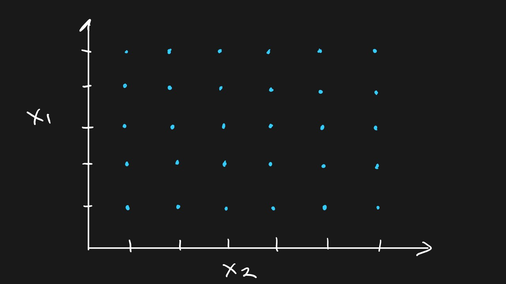
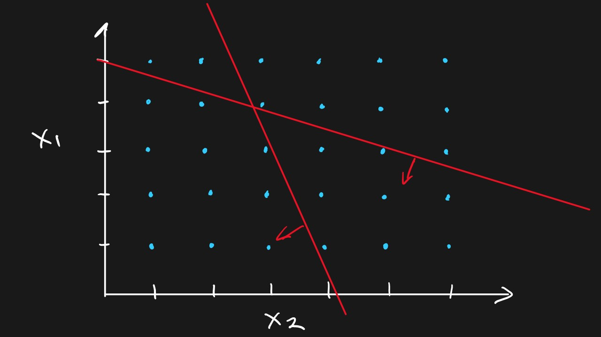
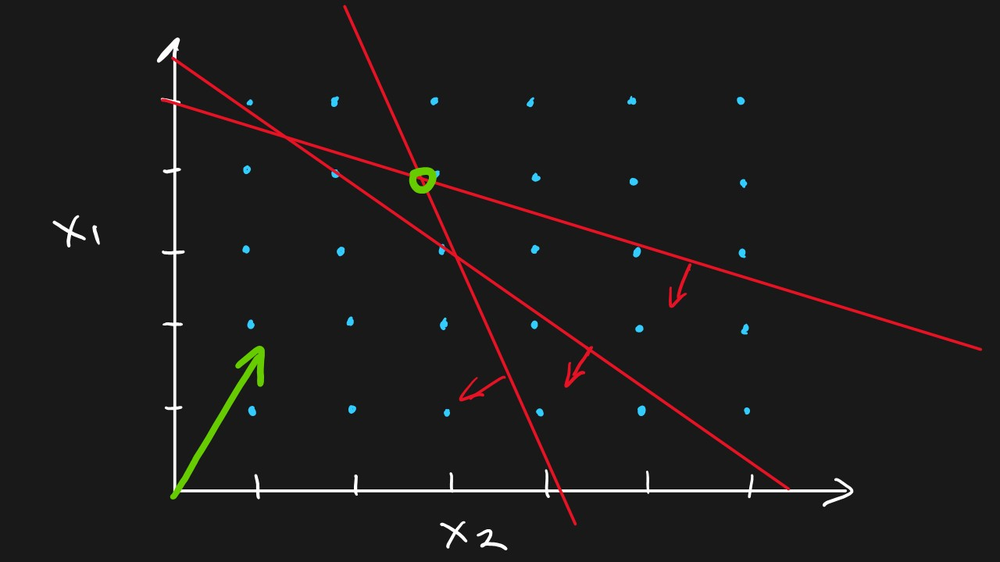
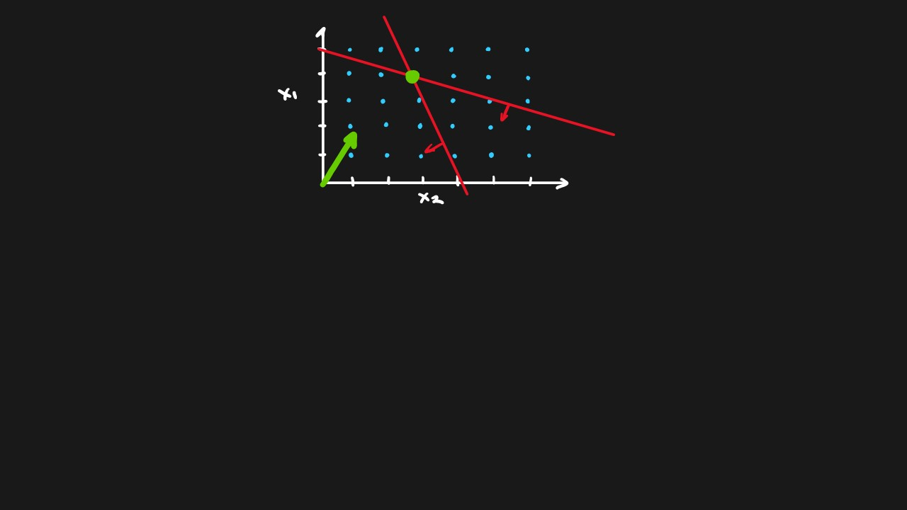
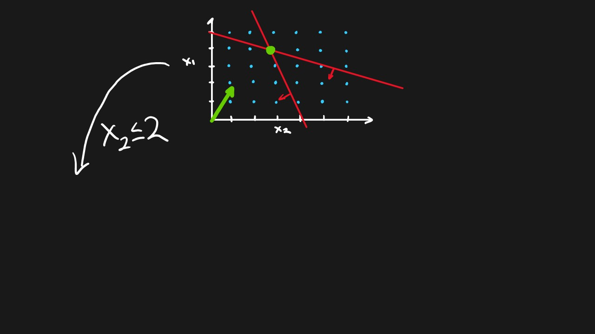
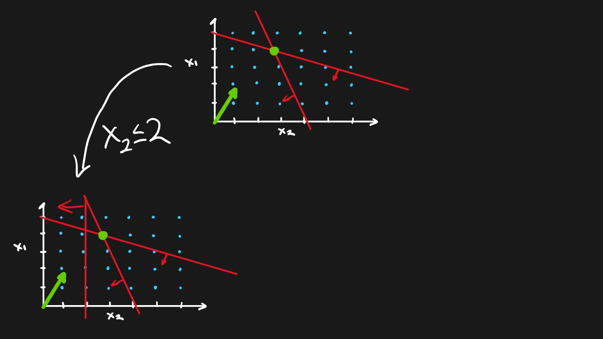
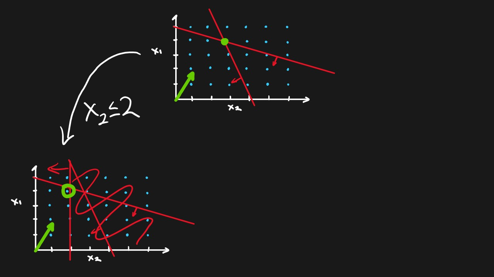
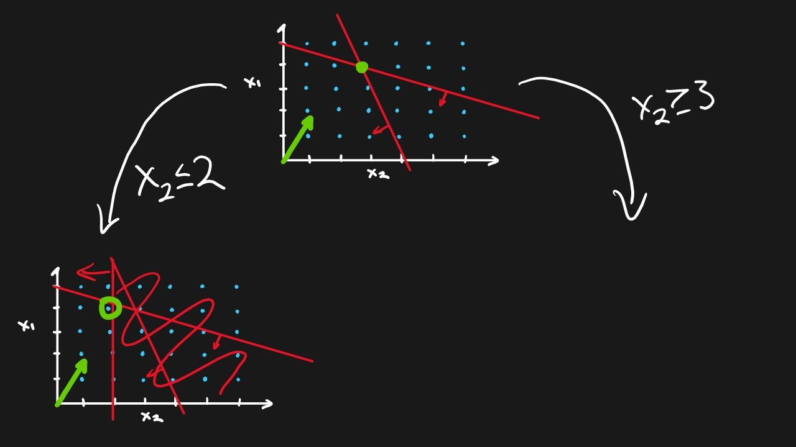
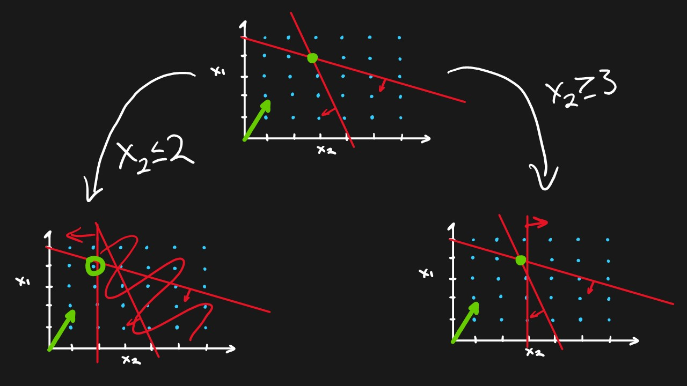
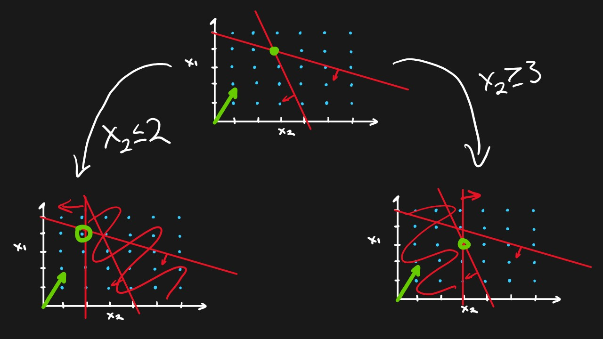

# Applied AI: Mathematical Planning

By Matthew Crews

---

## Questions we will answer...

- What is it? <!-- .element: class="fragment" -->
- What is it good for? <!-- .element: class="fragment" -->
- How do we do it? <!-- .element: class="fragment" -->
- How does it relate to ML? <!-- .element: class="fragment" -->

---

<!-- .slide: data-transition="slide-in fade-out" -->

# Why?

---

<section data-background-image="images/new_orleans.jpg"
         data-transition="fade">

---

## Mathematical Planning

<div style="text-align:left">
<p class="fragment">
Methods for finding the best plan
</p>
<p class="fragment" style="margin-left:2em">
given a set of <span style="color:orange;font-weight:bold">Decisions</span> to be made
</p>
<p class="fragment" style="margin-left:4em">
a list of <span style="color:orange;font-weight:bold">Constraints</span> to obey
</p>
<p class="fragment" style="margin-left:6em">
and a quantifiable <span style="color:orange;font-weight:bold">Objective</span>.
</p>
</div>

---

<!-- .slide: data-transition="fade" -->

Or put another way

---

<!-- .slide: data-transition="fade" data-transition-speed="slow" -->
# The Mathematics of Caring for People

---

## Who uses it?

---

<section data-background-image="images/freight.jpg"
         data-transition="fade">

---

<section data-background-image="images/finance_industry.jpg"
         data-transition="fade">

---

<section data-background-image="images/energy_sector.jpg"
         data-transition="fade">

---

<section data-background-image="images/retail_industry.jpg"
         data-transition="fade">

---

## And many more

---

<div style="font-size:250%">
Artifical Intelligence
</div>

<div style="font-size:200%">
<span class="fragment" data-fragment-index="1">MP</span>
<span class="fragment" data-fragment-index="3">≠</span>
<span class="fragment" data-fragment-index="2">ML</span>
</div>

---

<div style="font-size:300%">
<span class="fragment">MP</span>
<span class="fragment"> + </span>
<span class="fragment">ML</span>
<span class="fragment">= 💗</span>
</div>

---

<!-- .slide: data-background-image="images/energy_sector_night.jpg"
data-transition="fade" -->

<section data-background-image="images/energy_sector_night.jpg"
         data-transition="fade">

---

<section data-background-image="images/energy_sector_night.jpg"
         data-transition="fade"
         data-background-opacity="0.2">

<span class="fragment" class="fragment" style="font-size:300%"> ML feeds MP </span>

---

<section data-background-image="images/shipping_industry.jpg"
         data-transition="fade">

---

<section data-background-image="images/shipping_industry.jpg"
         data-transition="fade"
         data-background-opacity="0.2">

<span class="fragment" style="font-size:300%"> MP feed ML </span>

---

## How do we solve these problems now?

---

<!-- .slide: data-transition="fade" data-transition-speed="slow" -->


---

## The Crews Conjecture

> “At the heart of every business of significant age and/or size is an Excel App” - Matthew Crews

---

## How do we turn decision making processes into models?

---

<section data-background-image="images/food_truck.jpg"
         data-transition="fade">

---

<!-- .slide: data-transition="fade" data-transition-speed="slow" -->
<section data-background-image="images/food_truck.jpg"
         data-transition="fade"
         data-background-opacity="0.2">

## The Food Truck problem

- You make $1 per Taco and $2 per Burger <!-- .element: class="fragment" -->
- You have 200 Taco Shells and 300 Burger Buns <!-- .element: class="fragment" -->
- You can only carry 450 Lbs. of food <!-- .element: class="fragment" -->
- Each taco requires 1.5 Lbs. of toppings <!-- .element: class="fragment" -->
- Each Burger requires 1 Lb. of toppings <!-- .element: class="fragment" -->

---

## Ingredients for a Model

<ol>
<li><span style="color:orange;font-weight:bold">Decision Variables</span>: The choices me must make
</li>
<!-- .element: class="fragment" -->
<li>
<span style="color:orange;font-weight:bold">Objective</span>: How we measure success
</li>
<!-- .element: class="fragment" -->
<li>
<span style="color:orange;font-weight:bold">Constraints</span>: The rules we must obey 
</li>
<!-- .element: class="fragment" -->
</ol>

---

<div class="r-stack">


</div>

---

## Food Truck Model

<table style="width:100%">
<tr>
<td>

### Decisions <!-- .element: class="fragment" -->

Number of Burgers: x1 <!-- .element: class="fragment" -->

Number of Tacos: x2 <!-- .element: class="fragment" -->

### Objective <!-- .element: class="fragment" -->

Maximize Revenue <!-- .element: class="fragment" -->

$2.00 * x1 + $1.00 * x2 <!-- .element: class="fragment" -->
</td>
<td>

### Constraints <!-- .element: class="fragment" -->

Max Burger <!-- .element: class="fragment" -->

x1 ≤ 300 <!-- .element: class="fragment" -->

Max Taco <!-- .element: class="fragment" -->

x2 ≤ 200 <!-- .element: class="fragment" -->

Max Weight <!-- .element: class="fragment" -->

1.0 * x1 + 1.5 * x2 ≤ 450 <!-- .element: class="fragment" -->

</td>
</tr>
</table>

---

# Code!!

---

## How does this work?

---

<!-- .slide: data-transition="slide-in fade-out" data-transition-speed="slow" -->

<div style="text-align:left">
More formally, linear programming is a technique for the optimization of a linear objective function, subject to linear equality and linear inequality constraints. Its feasible region is a convex polytope, which is a set defined as the intersection of finitely many half spaces, each of which is defined by a linear inequality. Its objective function is a real-valued affine (linear) function defined on this polyhedron. A linear programming algorithm finds a point in the polytope where this function has the smallest (or largest) value if such a point exists.
<div>
<div style="text-align:right">- Wikipedia</div>

---

<!-- .slide: data-transition="zoom" data-transition-speed="slow" -->
# Huh?!?

---

<div class="r-stack">


</div>

---

> A LP solver searches the nodes defined by the intersection of the constraints until it cannot find a better solution.*
> <div style="text-align:right">- Matthew</div>


---

<section data-background-image="images/farm.jpg"
         data-transition="fade">

---

<section data-background-image="images/farm.jpg"
         data-transition="fade"
         data-background-opacity="0.2">

## Running a Farm Model

- We can raise Cows, Pigs, and Chickens. We earn $100 per Cow, $50 per Pig, and $8 per Chicken <!-- .element: class="fragment" -->
- We have 1,000 Acres of Pasture. It takes 1 Acre per Cow, 0.2 Acre per Pig, and 0.0 Acre per Chicken <!-- .element: class="fragment" -->
- We have 100 Tons of feed. Cow takes 0.0 Tons of Feed, a Pig takes 1.0, and a Chicken takes 0.1 <!-- .element: class="fragment" -->
- We have 7,200 hours of Labor. Cows take 9.5 hours, Pigs take 8, and Chickens take 0.0 <!-- .element: class="fragment" -->

---

### Running a Farm Model

<div style="text-align:left">

#### Decisions <!-- .element: class="fragment" -->

Number of Cows: cows <!-- .element: class="fragment" -->

Number of Pigs: pigs <!-- .element: class="fragment" -->

Number of Chickens: chickens <!-- .element: class="fragment" -->

#### Objective <!-- .element: class="fragment" -->

Maximize Revenue <!-- .element: class="fragment" -->

$100.00 * cows + $50.00 * pigs + $8.00 * chickens <!-- .element: class="fragment" -->

</div>

---

### Running a Farm Model

<div style="text-align:left">

#### Constraints <!-- .element: class="fragment" -->

Total Pasture <!-- .element: class="fragment" -->

1.0 * cows + 0.5 * pigs + 0.0 * chickens ≤ 1,000 <!-- .element: class="fragment" -->

Total Feed <!-- .element: class="fragment" -->

0.0 * cows +1.0 * pigs + 0.1 * chickens ≤ 100 <!-- .element: class="fragment" -->

Total Labor Hours <!-- .element: class="fragment" -->

9.5 * cows + 8 * pigs + 0.0 * chickens ≤ 7,200 <!-- .element: class="fragment" -->

</div>

---

# Code!!

---

<section data-background-image="images/building_scaling.jpg"
         data-transition="fade">

---

<section data-background-image="images/tools.jpg"
         data-transition="fade">

---

<section data-background-image="images/tools.jpg"
         data-transition="fade"
         data-background-opacity="0.2">

## Sets <!-- .element: class="fragment" -->

<div style="text-align:left">
What your data is indexed by. Often this is a list of primitives organized as a List, Array, or Set. We will use a List for now. The values should be distinct.
</div> <!-- .element: class="fragment" -->

```python
# Sets of values in a List for Python
cities = [“Detroit”, “Portland”, “LA”]
items = [“Hamburger”, “Hot Dog”, “Pizza”]
times = [1, 2, 3, 4, 5]
```
<!-- .element: class="fragment" -->

---

<section data-background-image="images/tools.jpg"
         data-transition="fade"
         data-background-opacity="0.2">

## Parameters <!-- .element: class="fragment" -->

<div style="text-align:left">
The data your model uses. Typically it is indexed by the values of your sets in a Dictionary/Map/Associative Array
</div> <!-- .element: class="fragment" -->

```python
# A Dictionary with the Item as the key
# and the cost as the associated value
item_costs = { “Hamburger” : 2.30, 
               “Hot Dog” : 1.50,
               “Pizza” : 2.75 }

# A Dictionary with the Location as the
# key and the size as the associated value
location_size = { "Detroit": 1000.0,
                  "Portland": 750.0,
                  "LA": 900.0 }
```
<!-- .element: class="fragment" -->

---

## Upgraded Ingredients List for Model

1. Sets <!-- .element: class="fragment" data-fragment-index="1" -->
2. Parameters <!-- .element: class="fragment" data-fragment-index="2" -->
3. Decision Variables <!-- .element: class="fragment" data-fragment-index="3" -->
4. Objective <!-- .element: class="fragment" data-fragment-index="3" -->
5. Constraints <!-- .element: class="fragment" data-fragment-index="3" -->

---

### Running a Farm Revised

<div style="text-align:left">

#### Sets <!-- .element: class="fragment" -->

Animals: ["Cow", "Chicken", "Pig"] <!-- .element: class="fragment" -->

#### Parameters <!-- .element: class="fragment" -->

revenue = {...} // A Dictionary with Revenue per Animal
<!-- .element: class="fragment" -->
pasture = {...} // A Dictionary with Pasture per Animal
<!-- .element: class="fragment" -->
feed = {...} // A Dictionary with Feed per Animal
<!-- .element: class="fragment" -->
labor = {...} // A Dictionary with Labor per Animal
<!-- .element: class="fragment" -->

</div>

---

### Running a Farm Revised

<div style="text-align:left">

#### Parameters

total_pasture = 1,000.0
<!-- .element: class="fragment" -->
total_feed = 100.0
<!-- .element: class="fragment" -->
total_labor = 7,200.0
<!-- .element: class="fragment" -->

</div>

---

### Running a Farm Revised

<div style="text-align:left">

#### Decision Variable <!-- .element: class="fragment" -->

How many of each animal
<!-- .element: class="fragment" -->
#### Objective <!-- .element: class="fragment" -->

Maximize Revenue:
<!-- .element: class="fragment" -->
Sum of (How many of an Animal * Revenue per Animal)
<!-- .element: class="fragment" -->
</div>

---

### Running a Farm Revised

<div style="text-align:left">

#### Constraints <!-- .element: class="fragment" -->

Sum of Pasture Used ≤ total_pasture
<!-- .element: class="fragment" -->
Sum of Feed Used ≤ total_feed
<!-- .element: class="fragment" -->
Sum of Labor Used ≤ total_labor
<!-- .element: class="fragment" -->

</div>

---

# Code!!

---

<div class="r-stack">


</div>

---

<div class="r-stack">


</div>

---

## Logic with Binary Decision Variables

<div style="text-align:left">
<div class="row">
<div class="column" style="float:left;width:50%">
AND: x1 + x2 = 2
</div>
<div class="column" style="float:left;width:50%">
Both must be TRUE
</div> 
</div> <!-- .element: class="fragment" -->
<div class="row">
<div class="column" style="float:left;width:50%">
OR: x1 + x2 ≥ 1
</div>
<div class="column" style="float:left;width:50%">
One or both must be TRUE
</div>
</div> <!-- .element: class="fragment" -->
<div class="row">
<div class="column" style="float:left;width:50%">
XOR: x1 + x2 = 1
</div>
<div class="column" style="float:left;width:50%">
Only one must be TRUE
</div>
</div> <!-- .element: class="fragment" -->
<div class="row">
<div class="column" style="float:left;width:50%">
XNOR: x1 – x2 = 0
</div>
<div class="column" style="float:left;width:50%">
Both TRUE or both FALSE
</div>
</div> <!-- .element: class="fragment" -->
<div class="row">
<div class="column" style="float:left;width:50%">
NAND: x1 + x2 ≤ 1
</div>
<div class="column" style="float:left;width:50%">
One may be TRUE
</div>
</div> <!-- .element: class="fragment" -->
</div>

---

<section data-background-image="images/coffee_brewing.jpg"
         data-transition="fade">

---

<section data-background-image="images/coffee_brewing.jpg"
         data-transition="fade"
         data-background-opacity="0.2">

### Portland Roasters Inc.

- We need to find where to build our Roasting Plants and Warehouses
<!-- .element: class="fragment" -->
- We need at least 30 Tons of Roasting capacity
<!-- .element: class="fragment" -->
- We need at least 30,000 sq.ft. of Warehouse space
<!-- .element: class="fragment" -->
- Wherever we build a Roasting Plant we need a Warehouse
<!-- .element: class="fragment" -->

---

### Portland Roasters Inc.

<div class="row" style="text-align:left">
<div class="column" style="float:left;width:40%">

#### Sets <!-- .element: class="fragment" -->

Locations <!-- .element: class="fragment" -->
</div>
<div class="column" style="float:left;width:60%">

#### Parameters <!-- .element: class="fragment" -->

RoasterCost by Location <!-- .element: class="fragment" -->

WarehouseCost by Location <!-- .element: class="fragment" -->

RoasterCapacity by Location <!-- .element: class="fragment" -->

WarehouseCapacity by Location <!-- .element: class="fragment" -->

MinRoastingCapacity <!-- .element: class="fragment" -->

MinWarehouseCapacity <!-- .element: class="fragment" -->
</div>
</div>

---

### Portland Roasters Inc.

<div style="text-align:left">

#### Decisions <!-- .element: class="fragment" -->

BuildRoaster : Binary
<!-- .element: class="fragment" -->
BuildWarehouse : Binary
<!-- .element: class="fragment" -->

#### Objective <!-- .element: class="fragment" -->

Minimize Cost:
<!-- .element: class="fragment" -->
Cost of Warehouses + Cost of Roasters
<!-- .element: class="fragment" -->

</div>

---

### Portland Roasters Inc.

<div style="text-align:left">

#### Constraints <!-- .element: class="fragment" -->

##### Min Warehouse Capacity
<!-- .element: class="fragment" -->

<span style="font-size:70%">Sum of Planned Warehouse Space ≥ MinWarehouseCapacity</span>
<!-- .element: class="fragment" -->

##### Min Roaster Capacity
<!-- .element: class="fragment" -->

<span style="font-size:70%">Sum of Planned Roaster Capacity ≥ MinRoasterCapacity</span>
<!-- .element: class="fragment" -->

##### Warehouse Required for Roaster
<!-- .element: class="fragment" -->

<p style="font-size:70%">
for each location
</p>
<!-- .element: class="fragment" -->
<p style="font-size:70%;margin-left:2em">
If you Build a Roaster, you must have a Warehouse
</p>
<!-- .element: class="fragment" -->

</div>

---

# Code!!

---

<section data-background-image="images/math_blackboard.jpg"
         data-transition="fade">

---

<section data-background-image="images/math_blackboard.jpg"
         data-transition="fade"
         data-background-opacity="0.2">

## How do we solve this?

---

<div class="r-stack">








</div>

---

# Cutting Planes

---

<div class="r-stack">












</div>

---

# Branch and Bound

---

<section data-background-image="images/contemplation.jpg"
         data-transition="fade">

---

<section data-background-image="images/contemplation.jpg"
         data-transition="fade"
         data-background-opacity="0.2">

## Key Takeaways

* Large, pure Linear Programs can be solved quickly
<!-- .element: class="fragment" -->
  - A large model is >100M Decisions and Constraints
<!-- .element: class="fragment" -->
* Adding Integer Decision Variables increases the difficulty by 10x
<!-- .element: class="fragment" -->
  - If you can, consider relaxing Integer Decision Variables to Continuous
<!-- .element: class="fragment" -->
* Complex Binary decisions increase the difficulty another 10x
<!-- .element: class="fragment" -->

---

<section data-background-image="images/power_plant.jpg"
         data-transition="fade">

---

<section data-background-image="images/power_plant.jpg"
         data-transition="fade"
         data-background-opacity="0.2">

## Power Planning

- We need to provide power for several cities
<!-- .element: class="fragment" -->
- There is a fixed cost for turning on a Power Plant
<!-- .element: class="fragment" -->
- Power Plants have different efficiencies, so the $/KW varies
<!-- .element: class="fragment" -->
- Cities have different power requirements, Min KWs
<!-- .element: class="fragment" -->

---

### Power Planning

<div style="text-align:left;font-size:80%">

#### Sets <!-- .element: class="fragment" -->

Cities = [...] // List of Cities <!-- .element: class="fragment" -->

PowerPlants = [...] // List of PowerPlants <!-- .element: class="fragment" -->

#### Parameters <!-- .element: class="fragment" -->

PowerRequired = {...} // The power required for each City
<!-- .element: class="fragment" -->
MaxPowerGeneration = {...} // The max power possible for a Plant
<!-- .element: class="fragment" -->
StartupCost = {...} // Cost to start Plant
<!-- .element: class="fragment" -->
PowerCost = {...} // Cost per KW for Plant
<!-- .element: class="fragment" -->

</div>

---

### Power Planning

<div style="text-align:left;font-size:80%">

#### Decision Variables <!-- .element: class="fragment" -->

RunPowerPlant = {...} // Binary: Whether to run Plant
<!-- .element: class="fragment" -->

PowerGeneration = {...} // Continuous: Power generated by Plant
<!-- .element: class="fragment" -->

PowerSent = {...} // Continuous: Power sent from a Plant to a City
<!-- .element: class="fragment" -->

</div>

---

### Power Planning

<div style="text-align:left;font-size:80%">

#### Objective <!-- .element: class="fragment" -->

MinimizeCost =
<!-- .element: class="fragment" -->
Sum of Turning On Power Plants + 
<!-- .element: class="fragment" -->
Sum of Power Generation Cost
<!-- .element: class="fragment" -->

</div>

---

### Power Planning

<div style="text-align:left;font-size:70%">

#### Constraints <!-- .element: class="fragment" -->

##### Power Capacity and Startup Required
<!-- .element: class="fragment" -->

<p>
for each Power Plant
</p>
<!-- .element: class="fragment" -->
<p style="margin-left:2em">
     Power Plant must be turned of if generating power
</p>
<!-- .element: class="fragment" -->


</div>

---

### Power Planning

<div style="text-align:left;font-size:80%">

#### Constraints <!-- .element: class="fragment" -->

##### Power Balance
<!-- .element: class="fragment" -->

<p>
for each  PowerPlant
</p>
<!-- .element: class="fragment" -->
<p style="margin-left:2em">
     Sum of Power Sent = Power Generated
</p>
<!-- .element: class="fragment" -->

##### Cities Powered
<!-- .element: class="fragment" -->

<p>
for each City
</p>
<!-- .element: class="fragment" -->
<p style="margin-left:2em">
Sum of Power Received = Power Required
</p>
<!-- .element: class="fragment" -->

</div>

---

# Code!!

---

<section data-background-image="images/thinking.jpg"
         data-transition="fade">

---

<section data-background-image="images/thinking.jpg"
         data-transition="fade"
         data-background-opacity="0.2">

# Takeaways...

<div style="text-align:left">
<p style="">
If you have
</p>
<!-- .element: class="fragment" -->
<p style="margin-left:2em">
<span style="color:orange;font-weight:bold">Decisions</span> to make
</p>
<!-- .element: class="fragment" -->
<p style="margin-left:4em">
<span style="color:orange;font-weight:bold">Constraints</span> to obey
</p>
<!-- .element: class="fragment" -->
<p style="margin-left:6em">
and a quantifiable <span style="color:orange;font-weight:bold">Objective</span>
</p>
<!-- .element: class="fragment" -->
</div>

## You have a Mathematical Planning problem!
<!-- .element: class="fragment" -->

---

# The End

---

---